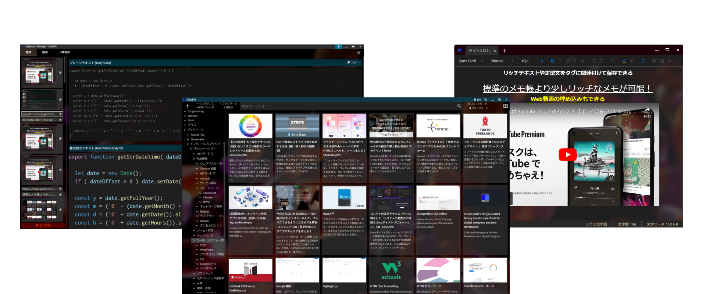
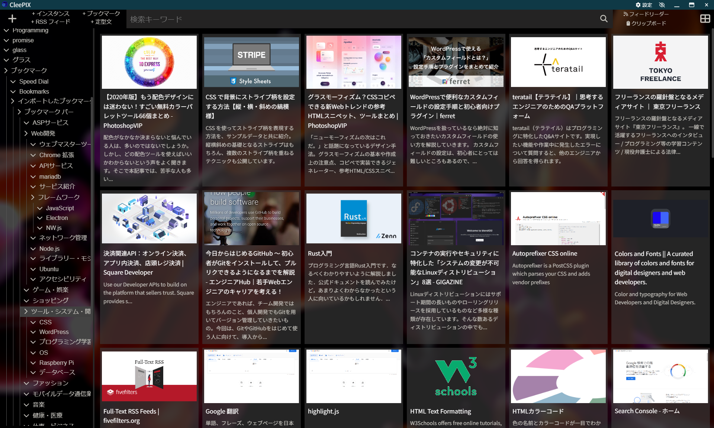
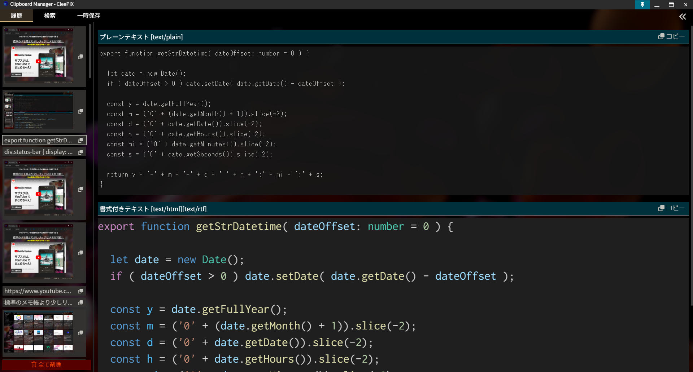
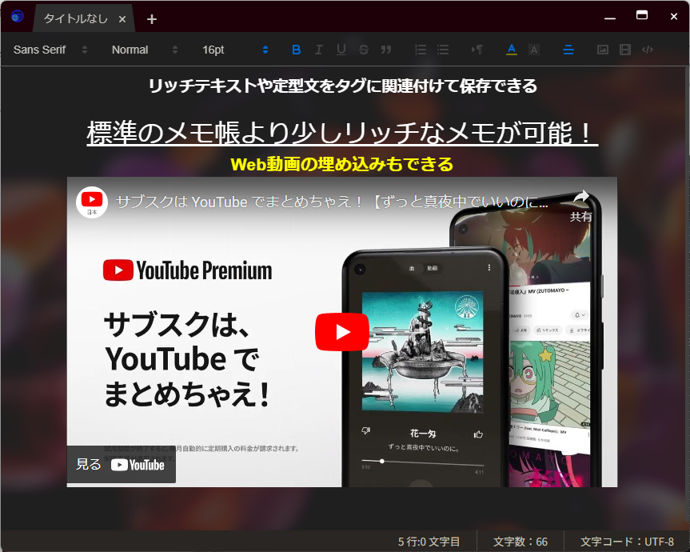

# CleePIX（開発中断）

ブックマーク、定型文、クリップボード、RSSをオールインワンで統合管理するアプリケーション。

## 主な機能
	v ブックマークしたWebページは、サムネイル付きでえ表示
		○ サムネイル画像は、Webページのメタ情報から読み取る
			§ 読み取れない場合は、自動でページのスクリーンショットをサムネイルとして保存する
		○ サムネイルは、自分で用意したものに変更できるようにする
	v ブックマークを保存する際は、WebページのHTMLソースも含める
	v ブックマークと一緒にメモ書きを保存できるようにする
	v ブラウザーの閲覧履歴を保存する
		○ ページタイトル・URL・ページソースを保存し、履歴の探索を効率化できるようにする
	v 保存したブックマークを開く際に、開きたいブラウザーを設定できるようにする
	v 各ブラウザーのホーム画面に、スピードダイヤルページを設けられるようにする
	v ブックマークの保存方式は、タグとし、最上位の階層にはインスタンス（ワークスペース）で区切ることができるようにする
		○ タグ自体にも階層構造を取り入れ、フォルダーシステえむを同様の機能とする
		○ タグには個別にパスワードロック機能を提供する
	v 保存されたブックマークの探索
		○ 検索条件に、タイトル・URL・タグ・記事全文を含めた検索機能
		○ 検索結果を並び替え表示できるようにする
	v 「後で見る」機能をつける
		○ 簡易的なフォルダー分けもできるようにする
	v マークダウン対応の定型文も保存できるようにする
	v RSSリーダー機能を搭載する
	v クリップボード履歴の記録機能
		○ 保存するデータは、画像とテキスト（書式付きを含む）
		○ 違うデバイスでも即時にクリップボードを共有できるようにする
	v ブックマーク登録時の操作を簡略化するため、専用のChrome拡張機能を開発し、組み込む
	v 他ブラウザーからのブックマークのインポート・エクスポート機能のサポート
	v デバイス間で、データをリアルタイム同期できるようにする
	v UIの構想
		○ アプリのテーマを自由に選択できるようにする
		○ タグの背景・文字色を好きな色に変更できるようにする

## スクリーンショット

<dr/>

 

 
